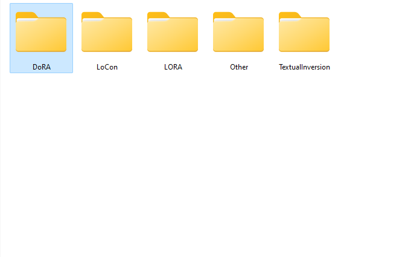

# TagMate 2

TagMate 2 is a Python application for organizing and categorizing AI model files, particularly those from Civitai. It provides a graphical user interface for easy file management and categorization based on various criteria.



## Features

- Categorize files based on model type, NSFW status, and SD version/base model
- Rename files according to model names
- Concatenate tags for more specific categorization
- Rollback changes if needed
- User-friendly GUI built with tkinter


## Installation

1. Clone this repository:
2. Install the required dependencies:
```pip install -r requirements.txt```
3. Run the application:
```python TagMate.py```


## Usage

This app requires that you have used civitai helper to download all the .civitai.info files associated with the models

1. Select input and output directories
2. Configure categorization options
3. Manage tags using the provided buttons
4. Click "Start Categorization" to begin the process
5. Use the "Rollback" button if you need to undo the changes

## Contributing

Contributions are welcome! Please feel free to submit a Pull Request.

## Support Me

If you find this application useful, consider supporting me:

[](https://buymeacoffee.com/milky99)

I'm a refugee in the United States and in desperate need of money so every $ will help

Your support means everything to me!

## License

This project is licensed under the MIT License - see the [LICENSE](LICENSE) file for details.
